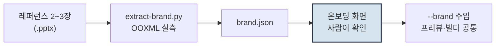

# merry-slide

[](https://github.com/merryAI-dev/merry-slide/actions/workflows/ci.yml)

**당신 팀의 슬라이드 2~3장에서 디자인 규칙을 실측해, 편집 가능한 네이티브 PowerPoint를 만드는 Claude Code 스킬.**

이미지로 찍어낸 슬라이드가 아닙니다. 표·도형·차트가 전부 PowerPoint 객체라 열어서 그대로 고칠 수 있습니다. 그리고 특정 회사 템플릿에 묶여 있지 않습니다 — 어떤 팀의 양식이든 대표 슬라이드 몇 장이면 그 톤을 배웁니다.

```bash
git clone https://github.com/merryAI-dev/merry-slide.git ~/.claude/skills/merry-slide
bash ~/.claude/skills/merry-slide/scripts/setup-deps.sh
```

설치 후 Claude Code에 `제안서 만들어줘`라고 말하면 됩니다.

---

## 브랜드는 하드코딩이 아니라 추출합니다



**① 실측** — 레퍼런스 `.pptx`의 OOXML을 직접 파싱합니다. 핵심 판별 규칙은 *"반복이 곧 브랜드 규칙"*: 2장 이상에서 같은 좌표에 나타난 요소만 규칙으로 인정하고, 한 장짜리 장식은 버립니다. 개발 과정에서 32장 수동 분석과 3장 자동 추출을 대조했을 때 차이는 콘텐츠 하단 경계 0.13in 하나였습니다.

**② 사람이 확인** — 강조색이 맞는지는 코드가 판정할 수 없습니다. 그 팀 사람만 압니다. 그래서 추출 결과를 문서가 아니라 **확인 화면**으로 보여줍니다: 폰트 설치 여부(브라우저가 직접 판정), 역할 배정된 팔레트, 표지·간지·본문 골격의 실물 축소판. "맞아"라고 해야 다음으로 갑니다.

**③ 주입** — 확정된 브랜드는 `--brand <이름>` 하나로 프리뷰와 빌더에 함께 주입됩니다. 캔버스가 A4든 16:9든 배치가 그 비율로 다시 유도되고, 실측값(헤더 룰, 표 행높이)이 있으면 그것이 우선합니다.

```bash
python3 scripts/extract-brand.py 레퍼런스.pptx --name acme --out references/brands
node scripts/onboard-brand.mjs --brand acme          # 확인 화면
node scripts/preview-composition.mjs --plan plan.json --brand acme --serve
```

---

## 기술적으로 다른 점

**미리보기와 결과물이 좌표를 공유합니다.** 브라우저 프리뷰와 PPTX 빌더가 `T.grid` 객체 하나를 함께 참조합니다. 좌표가 두 곳에 복제되지 않으므로 확정한 모습과 결과가 어긋날 수 없습니다.

**넘침을 렌더 전에 잡습니다.** 한글 1.0 / 그 외 0.55 가중치로 시각 길이를 계산해, 박스를 넘길 텍스트를 빌드 시점에 리포트합니다.

**간트차트가 네이티브 차트입니다.** 투명 오프셋 + 기간 계열을 쌓는 stacked bar 기법. 그림이 아니라 차트 객체라 일정을 PowerPoint에서 직접 수정합니다.

**이미지는 자르지 않습니다.** 슬롯에 맞춰 늘리고 줄일 뿐, 크롭도 레터박스도 없습니다. 사진 수백 장 폴더는 `--serve`가 HTTP로 내주어 미리보기가 수백 KB에 그칩니다.

**사람이 결정하는 지점이 설계에 박혀 있습니다.** 이것은 전자동 플랫폼이 아니라 스킬입니다. 준비 점검(CP0) → 기본값(CP1) → 브랜드 확인(CP2) → 형식·문구·순서 확정(CP3) → 육안 검수(CP4). CP3에서는 8가지 장표 형식을 실제 문구가 들어간 렌더로 나란히 놓고 눈으로 골라, `이 장 확정`을 누른 순서가 그대로 덱이 됩니다.

---

## 검증

`node tests/smoke.mjs` — 기본 브랜드와 정반대 양식(16:9, 다른 팔레트, 사이드바, 다른 폰트)의 레퍼런스를 코드로 만들어 **추출 → 주입 → 빌드 → OOXML 검증**을 한 번에 돌립니다. CI가 매 커밋마다 같은 것을 실행합니다.

## 문서

- [`SKILL.md`](SKILL.md) — 스테이지별 규칙과 체크포인트 (스킬의 실제 동작 기준)
- [`references/brand-extraction.md`](references/brand-extraction.md) — 브랜드 추출 계약
- [`references/composition-format.md`](references/composition-format.md) — 장표 형식과 콘텐츠 스키마
- [`references/design-quality-gate.md`](references/design-quality-gate.md) — 금지 패턴

## 아직 부족한 것

- 글(리드 문단)의 품질은 사람 손이 필요합니다. 형식은 도구가, 글은 사람이 씁니다.
- 기본 팔레트는 데모용입니다. 실제 작업은 반드시 자기 브랜드를 추출해서 쓰세요.

## License

MIT — [LICENSE](LICENSE) 참고. 코드와 배치 구조만 포함하며, 특정 조직의 로고·이미지·문장 자산은 이 저장소에 없습니다.
